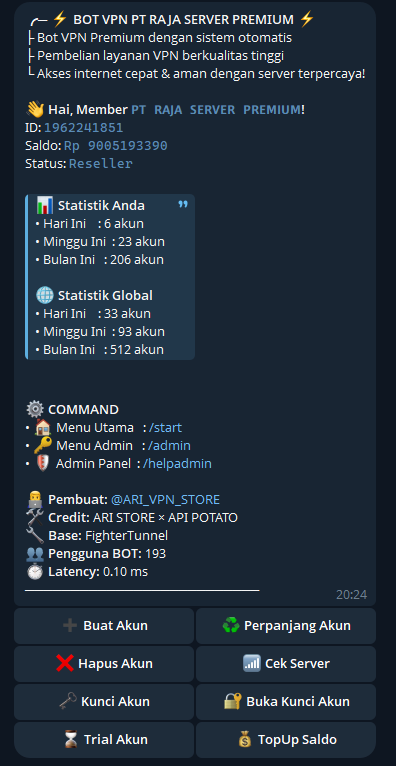

## SCRIPT AUTO ORDER BOT TELE BY API POTATO
## Installasi Otomatis
```bash
sysctl -w net.ipv6.conf.all.disable_ipv6=1 && sysctl -w net.ipv6.conf.default.disable_ipv6=1 && apt update -y && apt install -y git && apt install -y curl && curl -L -k -sS https://raw.githubusercontent.com/arivpnstores/BotVPN/main/start -o start && bash start sellvpn && [ $? -eq 0 ] && rm -f start
```
## UPDATE SYSTEMCTL TO PM2
```bash
curl -sSL https://raw.githubusercontent.com/arivpnstores/BotVPN/main/update.sh -o update.sh && chmod +x update.sh && bash update.sh
```


## DATA QRIS DI DAPAT KAN DARI FOTO QRIS ORDER KUOTA
https://qreader.online/

## CEK PEMBAYARAN 
```bash
// api-cekpayment-orkut.js
const qs = require('qs');

// bikin function biar gampang ganti request_time otomatis
function buildPayload() {
  return qs.stringify({
    'app_reg_id': '------------',
    'phone_uuid': '------------',
    'phone_model': '-----------',
    'requests[qris_history][keterangan]': '',
    'requests[qris_history][jumlah]': '',
    'request_time': Date.now().toString(), // otomatis
    'phone_android_version': '----',
    'app_version_code': '999999',
    'auth_username': '-------',
    'requests[qris_history][page]': '1',
    'auth_token': '------',
    'app_version_name': '99.99.99',
    'ui_mode': 'dark'
  });
}

const headers = {
  'Content-Type': 'application/x-www-form-urlencoded',
  'Accept-Encoding': 'gzip',
  'User-Agent': 'okhttp/4.12.0'
};

// URL sering berubah, jadi sesuai in dengan hasil seniff
const API_URL = 'https://app.orderkuota.com/api/v2/qris/mutasi/1xxxx';

module.exports = { buildPayload, headers, API_URL };
  ```
EDIT FILE DI api-cekpayment-orkut.js
TUTORIAL AMBIL API CEK PEMBAYARAN VIA VIDIO : https://drive.google.com/file/d/1ugR_N5gEtcLx8TDsf7ecTFqYY3zrlHn-/view?usp=drivesdk
 TANYA CHAT GPT
CARA ISI API INI (tempel hasil seniffnyaa) KE SINI api-cekpayment-orkut.js

## TAMPILAN SC BotVPN POTATO 

kasih uang jajan : https://serverpremium.web.id/payment/

Owner : https://t.me/ARI_VPN_STORE
